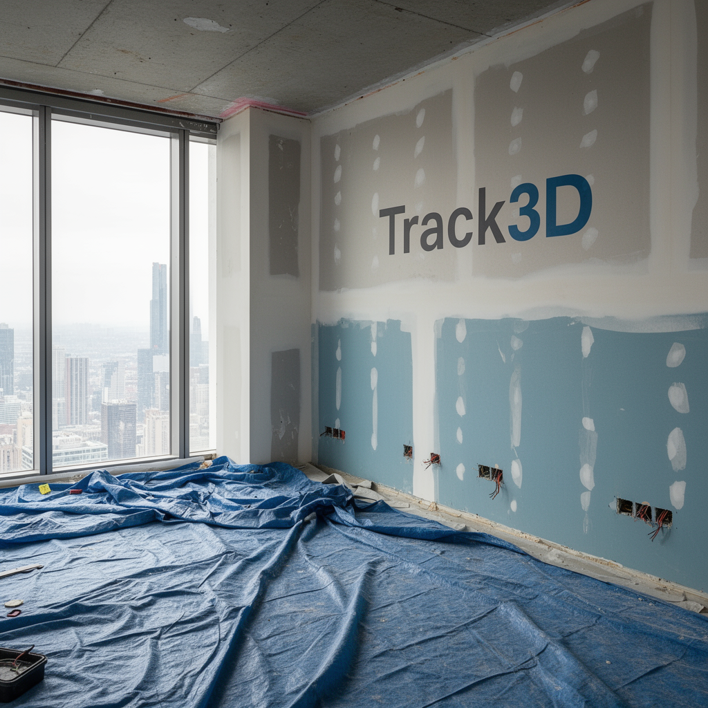
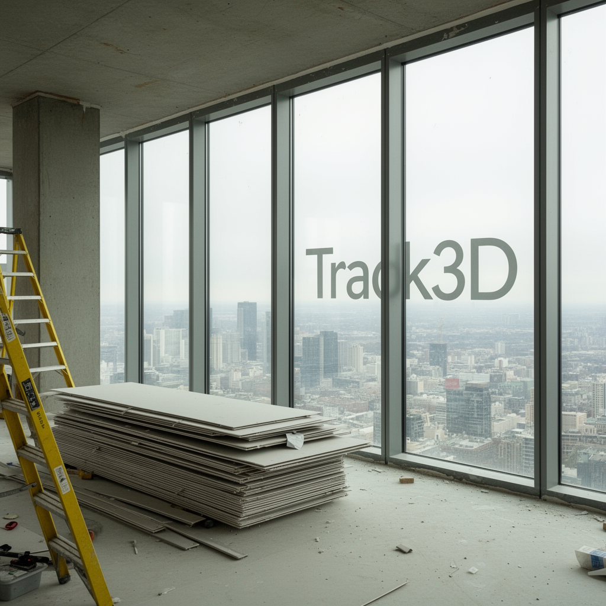
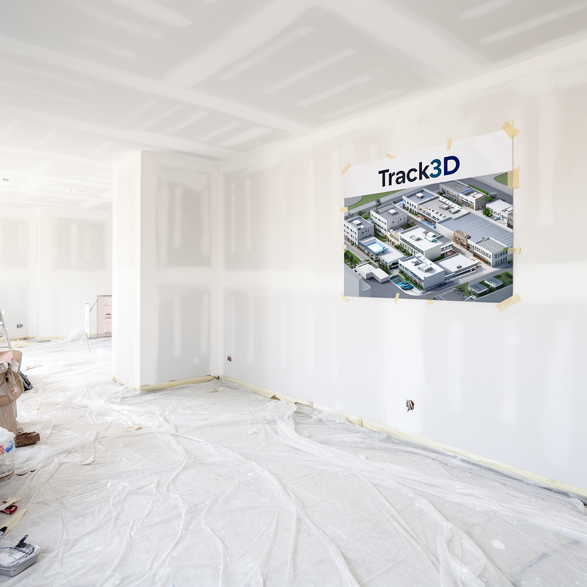
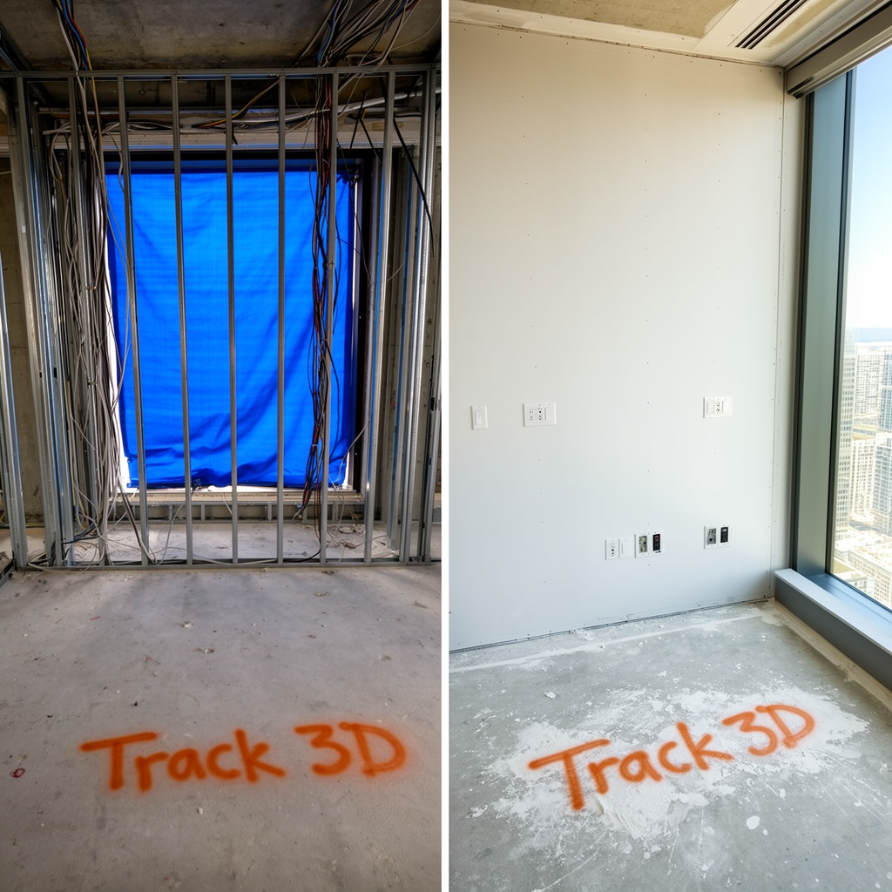

# GroundedVision

**GroundedVision** explores the intersection of Computer Vision and the construction domain. This repository contains experiments and reference implementations for analyzing dynamic job sites, including:

* Safety Compliance: PPE detection and hazard identification.

* Progress Monitoring: Geometric comparison and activity recognition.

* Quality Control: Semantic segmentation for defect detection in concrete and structural elements.


## Project Organization

```
├── LICENSE            <- Open-source license
├── Makefile           <- Makefile with convenience commands like `make data` or `make train`
├── README.md          <- The top-level README for developers using this project.
├── data
│   ├── external       <- Data from third party sources.
│   ├── interim        <- Intermediate data that has been transformed.
│   ├── processed      <- The final, canonical data sets for modeling.
│   └── raw            <- The original, immutable data dump.
│
├── docs               <- A default mkdocs project; see www.mkdocs.org for details
│
├── models             <- Trained and serialized models, model predictions, or model summaries
│
├── notebooks          <- Jupyter notebooks. Naming convention is a number (for ordering),
│                         the creator's initials, and a short `-` delimited description, e.g.
│                         `1.0-jqp-initial-data-exploration`.
│
├── pyproject.toml     <- Project configuration file with package metadata for 
│                         groundedvision and configuration for tools like black
│
├── references         <- Data dictionaries, manuals, and all other explanatory materials.
│
├── reports            <- Generated analysis as HTML, PDF, LaTeX, etc.
│   └── figures        <- Generated graphics and figures to be used in reporting
│
├── requirements.txt   <- The requirements file for reproducing the analysis environment, e.g.
│                         generated with `pip freeze > requirements.txt`
│
├── setup.cfg          <- Configuration file for flake8
│
└── groundedvision   <- Source code for use in this project.
    │
    ├── __init__.py             <- Makes groundedvision a Python module
    │
    ├── config.py               <- Store useful variables and configuration
    │
    ├── dataset.py              <- Scripts to download or generate data
    │
    ├── features.py             <- Code to create features for modeling
    │
    ├── modeling                
    │   ├── __init__.py 
    │   ├── predict.py          <- Code to run model inference with trained models          
    │   └── train.py            <- Code to train models
    │
    └── plots.py                <- Code to create visualizations
```

--------

## Development Setup

```
conda create -n track3d_dev python=3.12
conda deactivate
conda activate track3d_dev
```

### Install dependecies

```
make requirements
```


### Generate synthetic Data for Training and testing

FLUX.2 is the recent series of image generation models from Black Forest Labs.
FLUX.2 can be used for both image-guided and text-guided image generation.

Sample Construction images generated using Flux

<table>
  <tr>
    <td></td>
    <td></td>
  </tr>
  <tr>
    <td></td>
    <td></td>
  </tr>
</table>


Sample Side by Side Comparision images Generated Using Flux

<table>
  <tr>
    <td></td>
    <td></td>
  </tr>
  <tr>
    <td></td>
    <td></td>
  </tr>
</table>